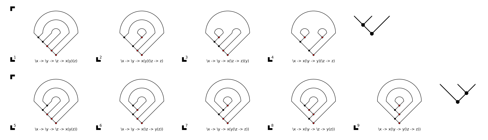

# Gallery of diagrams

## Families of lambda terms

* normal LR-planar terms: , 
* normal RL-planar terms: , 
* indecomposable normal LR-planar terms: , , 
* indecomposable normal RL-planar terms: , , 

## Miscellaneous

* Catalan structures: 
